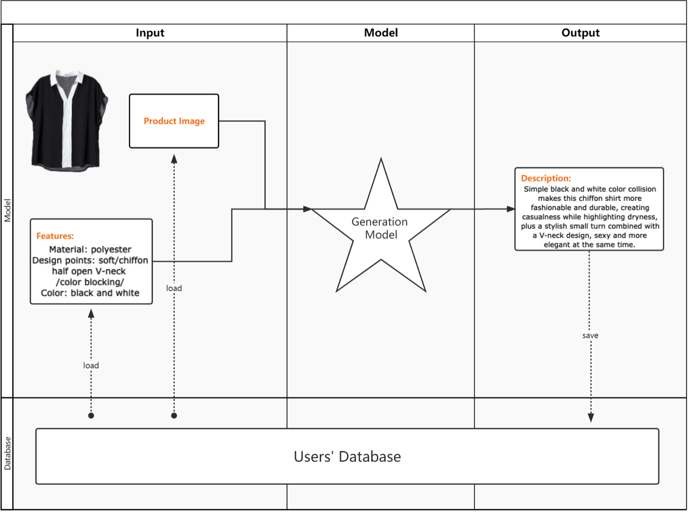
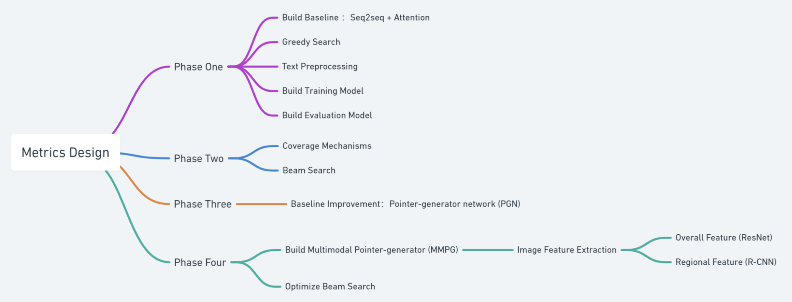
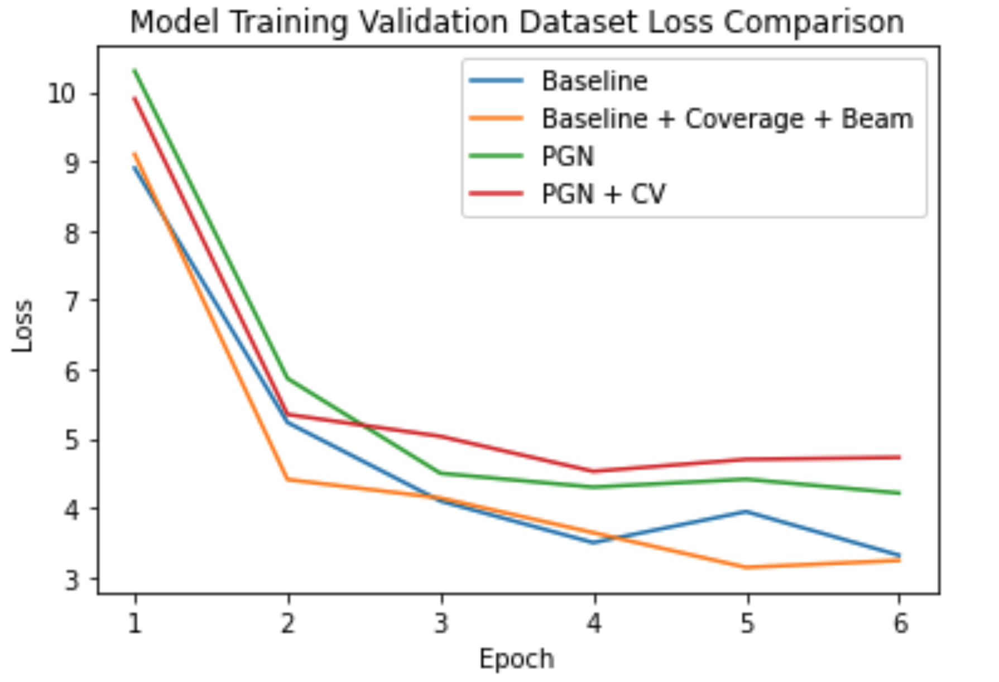
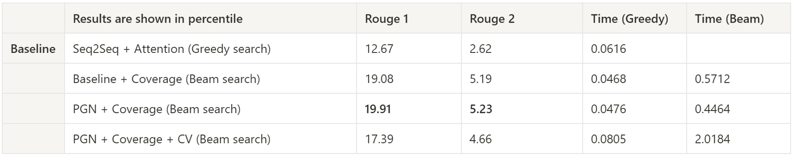

# Intelligent Marketing Text Generation

## Project overview and objective

We design a solution to generate the clothes description automatically. The customers can select and import the clothes images and its features or labels, then the model will generate the description of the clothes for marketing purposes.

### Prototyping

Our solution is connected to an existing database to facilitate the reading and storage of the model's data. Customers can import a large number of image files with any format at one time and the output will be a file that contains the description for each clothes. This product will save the preparation time for customers to fasten the promotion of their own products.

### Technical Design
The dataset concludes 30K pairs of marketing texts and image of products. 

Based on the project proposal described in the above sections. Our major objectives are as follows:
* We design a summarizer that can automatically generate an aspect-aware textual summary for clothing products by integrating textual and visual product information.
* We propose a multimodal pointer-generator network and explore various approaches to using product images in the product summarization task.
* We adopt aspect training, aspect coverage, and aspect coherence strategies, which aim to improve importance, non-redundancy, and readability, respectively.


### Solution Assessment
We have two metrics to judge the performance of the model, one is the loss function on the validation set during training, and the other is the ROUGE metric.

We have two metrics to judge the performance of the model, one is the loss function on the validation set during training, and the other is the ROUGE metric. How should we choose?
The loss curve of the model on the validation set during the training process shows that Baseline and Baseline the modified version (Coverage+Beam) have the lowest loss, but the ROUGE metric of Baseline is not great. This is due to the inconsistency of the loss function and the evaluation metrics. Although the model can generate mathematically similar results, it may not be consistent with human reading habits. Therefore, the ROUGE metric is more representative of the model's ability by taking into account the context and the corresponding vocabulary.



## Repository structure

 The repository has the following structure:

```.
├── README.md
├── code/
├── writeup/
└── img/

```
### Description

* The `code/` directory is where we wrote all of scripts. 
* The `writeup/` directory contains our report and presentation slide.
* The `img/` directory contains screenshots for the README.
